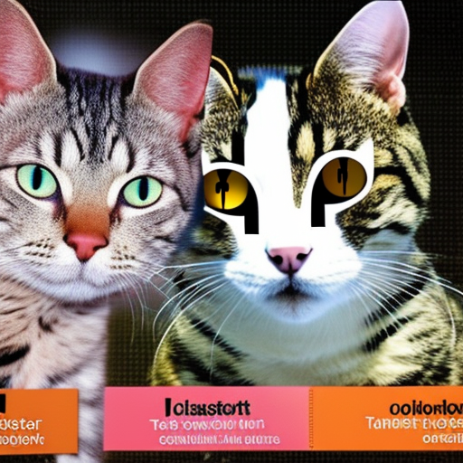

# Medium-effort post

It seems like stable diffusion is doesn't have obvious prompts for diagrams of modern deep networks.

<p align="center">
    
</p>

Prompt:
```
Teacher giving powerpoint lecture with diagram of cat vs dog classifier convolutional neural network
```

<p align='center'>
    
</p>
Prompt:
```
Professor giving lecutre on coding generative AI models, concept art
```